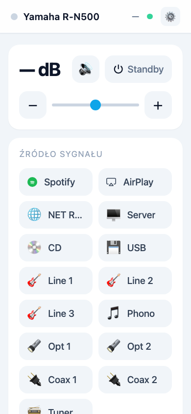
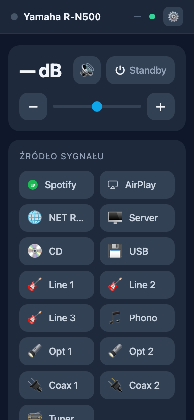
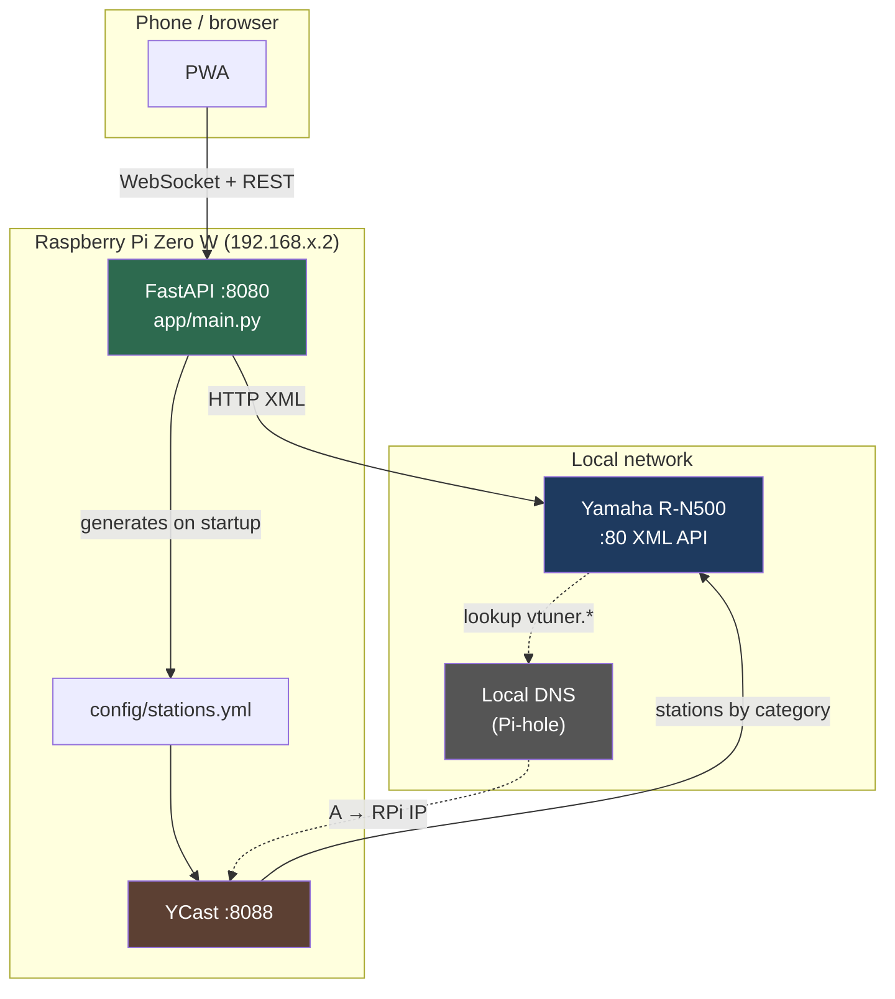
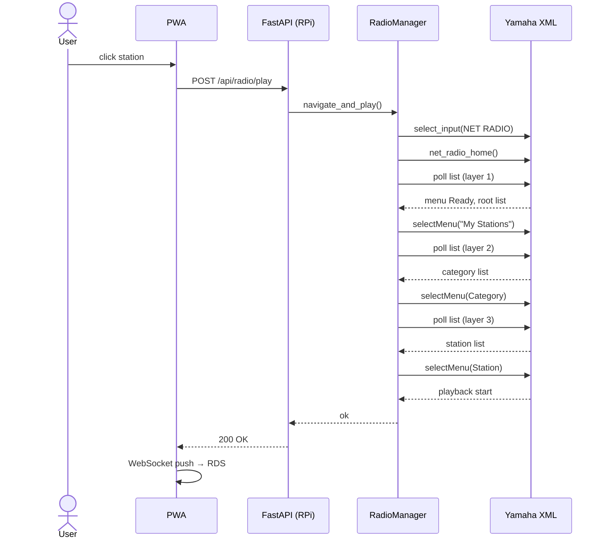
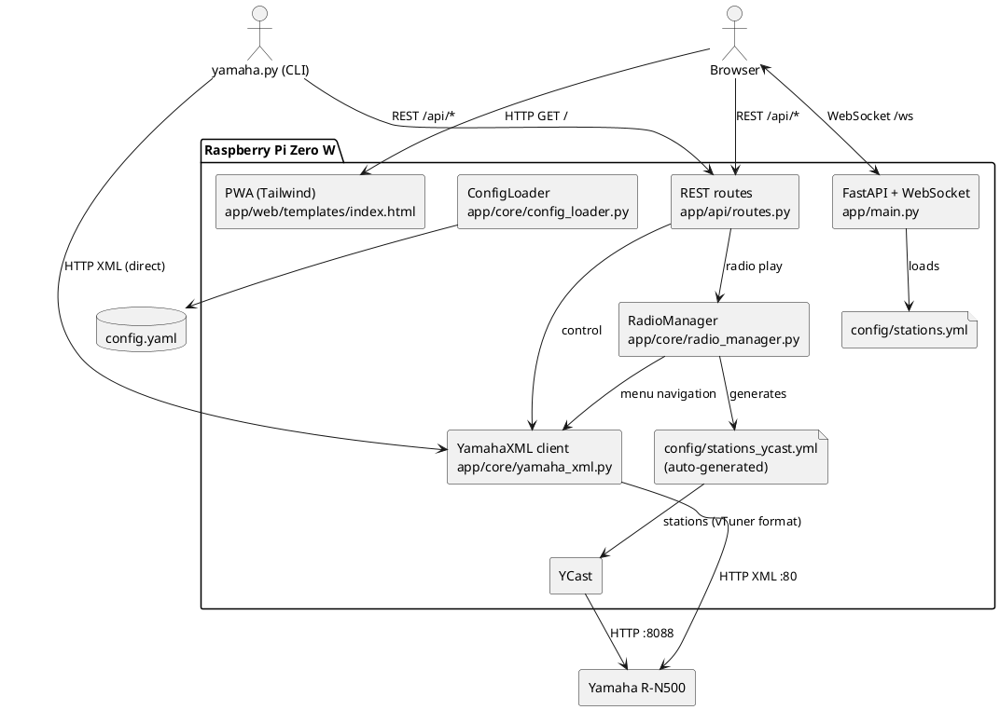

# Yamaha R-N500 Controller

Local web app (PWA) + CLI to control the **Yamaha R-N500** amplifier over the home network.  
The server runs on a **Raspberry Pi Zero W** and replaces the official Yamaha mobile app.

---

## Features

| Feature | PWA | CLI |
|---------|-----|-----|
| Power on / off | ✅ | ✅ |
| Volume control (slider, buttons, command queue) | ✅ | ✅ |
| Mute / unmute | ✅ | ✅ |
| Input source selection (Spotify, AirPlay, NET Radio, CD, USB, Line, Optical, Coax, Phono) | ✅ | ✅ |
| Internet radio (station list → YCast navigation) | ✅ | ✅ |
| RDS display (station name + track / artist) | ✅ | ✅ |
| Light / dark theme (follows OS) | ✅ | — |
| PWA install (home screen icon) | ✅ | — |
| Station list filtering | ✅ | ✅ |
| Adjustable font size | ✅ | — |

---

## Screenshots

<table>
<tr>
<td align="center"><b>Light mode</b></td>
<td align="center"><b>Dark mode</b></td>
</tr>
<tr>
<td></td>
<td></td>
</tr>
</table>

Light/dark theme is selected automatically based on the OS setting.  
Font size can be adjusted using the **⚙** button in the header (range 70–200 %, saved in the browser).

---

## Architecture



### How radio works — station change flow



> Station change takes **~5–8 s** — that's how long the Yamaha XML menu navigation sequence takes.  
> Sending a stream URL directly is not supported by the Yamaha XML protocol; menu navigation is required.

---

## Components



---

## Hardware requirements

| Component | Role |
|-----------|------|
| Raspberry Pi Zero W | App server + YCast |
| Yamaha R-N500 | Amplifier (LAN, port 80) |
| Router with local DNS or Pi-hole | Redirect `vtuner.*` → RPi IP |

---

## Installation

### 1. Raspberry Pi OS — prepare the system

```bash
sudo apt update && sudo apt upgrade -y
sudo apt install -y python3-venv git curl
```

### 2. Clone the repository

```bash
git clone https://github.com/mbawiec/yamaha-r-n500.git
cd yamaha-r-n500
```

### 3. Python virtual environment

```bash
python3 -m venv venv
source venv/bin/activate
pip install --upgrade pip
pip install -r requirements.txt
```

### 4. Application configuration

```bash
cp config.yaml.example config.yaml
nano config.yaml
```

```yaml
network:
  yamaha_ip: "192.168.1.100"   # Yamaha R-N500 IP on the local network
  rpi_ip: "192.168.1.2"        # This RPi's IP (optional; derived from Yamaha subnet if not set)
  api_port: 8080
  poll_interval: 2.0

radio:
  stations_path: "/home/pi/yamaha-r-n500/config/stations.yml"
  ycast_stations_path: "/home/pi/yamaha-r-n500/config/stations_ycast.yml"

system:
  max_volume_limit: -200
```

> **`rpi_ip`** is optional — if not set, the last octet of the Yamaha IP is replaced with `.2`.

### 5. YCast — internet radio station server

YCast impersonates vTuner. The Yamaha connects to it via DNS redirect.

```bash
pip install ycast

# Ensure directory exists
sudo mkdir -p /etc/ycast

# stations_ycast.yml is generated AUTOMATICALLY by the app on every startup.
# To generate it manually:
python - <<'EOF'
import sys; sys.path.insert(0, '.')
from app.core import radio_manager
radio_manager.generate_ycast_stations()
EOF

# Copy to YCast location
sudo cp config/stations_ycast.yml /etc/ycast/stations.yml
```

Start YCast (port 8088):

```bash
ycast -l 0.0.0.0 -p 8088
```

Or as a systemd service (see below).

### 6. DNS redirect — Pi-hole

When the Yamaha R-N500 accesses NET RADIO, it queries vTuner domains to get the station list.  
We redirect those queries to our YCast server.

In **Pi-hole** (`Settings → DNS → Custom DNS records` or `/etc/pihole/custom.list`):

```
192.168.1.2  vtuner.com
192.168.1.2  www.vtuner.com
192.168.1.2  radio.yamaha.com
192.168.1.2  yradio.eu
```

Alternatively in `/etc/hosts` on the RPi (if the RPi is also the DNS server):

```
192.168.1.2  vtuner.com
192.168.1.2  www.vtuner.com
192.168.1.2  radio.yamaha.com
192.168.1.2  yradio.eu
```

Verify it works:

```bash
# From any machine on the network:
curl -s "http://vtuner.com:8088/setupapp/scripts/asp/BrowseXML/loginXML.asp?token=0" | head -5
# Should return XML with "My Stations" category
```

### 7. Start the application server

```bash
./run.sh
```

`run.sh` auto-detects TLS certs in the project root — if found it starts HTTPS, otherwise HTTP.  
Explicit options:

```bash
./run.sh           # auto: HTTPS if certs exist, else HTTP
./run.sh --https   # force HTTPS (error if no certs)
./run.sh --http    # force plain HTTP
./run.sh --port 9000  # custom port (default: 8080)
```

The script prints the access URL on startup. App available at: **`http(s)://<RPi IP>:8080`**

On startup the server automatically generates `config/stations_ycast.yml` from `config/stations.yml`.

### 8. systemd services (autostart)

**Web app** — `/etc/systemd/system/yamaha-app.service`:

```ini
[Unit]
Description=Yamaha R-N500 Controller
After=network.target

[Service]
User=pi
WorkingDirectory=/home/pi/yamaha-r-n500
ExecStart=/bin/bash /home/pi/yamaha-r-n500/run.sh
Restart=on-failure
RestartSec=5

[Install]
WantedBy=multi-user.target
```

> `run.sh` auto-detects TLS certs, so the same service file works for both HTTP and HTTPS.  
> Generate certs first with `./setup.sh --https`; restart the service afterwards.

**YCast** — `/etc/systemd/system/ycast.service`:

```ini
[Unit]
Description=YCast vTuner replacement
After=network.target

[Service]
User=pi
ExecStart=/home/pi/yamaha-r-n500/venv/bin/ycast -l 0.0.0.0 -p 8088
Restart=on-failure
RestartSec=5

[Install]
WantedBy=multi-user.target
```

Enable both:

```bash
sudo systemctl daemon-reload
sudo systemctl enable --now yamaha-app ycast
sudo systemctl status yamaha-app ycast
```

---

## Station list format (`config/stations.yml`)

The file supports a **3-level format**:

```yaml
Category:
  Station Name:             # multiple qualities → opens sub-menu in PWA
    Quality 1: "https://stream.example.com/hi.aac"
    Quality 2: "https://stream.example.com/lo.mp3"
  Another Station: "https://..."   # single quality → plays immediately
```

**Example from `config/stations.yml`:**

```yaml
Polskie:
  Radio Nowy Świat:
    AAC: "https://stream.rcs.revma.com/4md4m0a0fs8uv"
    MP3: "https://stream.nowyswiat.online/mp3"
  Radio 357: "https://stream.radio357.pl/"

BBC:
  BBC Radio 2: "https://a.files.bbci.co.uk/ms6/live/.../bbc_radio_two.m3u8"

Audiofil:
  Radio Paradise:
    FLAC: "https://stream.radioparadise.com/flac"
    AAC 320k: "https://stream.radioparadise.com/aac-320"
```

`config/stations_ycast.yml` is **auto-generated on server startup** — do not edit it manually.  
Multi-quality stations are expanded into separate entries: `"Radio Paradise FLAC"`, `"Radio Paradise AAC 320k"`.

---

## REST API

| Method | Endpoint | Body / params | Description |
|--------|----------|---------------|-------------|
| `GET` | `/api/status` | — | Current device state |
| `POST` | `/api/power/{state}` | `state`: `On` or `Standby` | Power on / off |
| `POST` | `/api/volume/up` | — | Volume +0.5 dB |
| `POST` | `/api/volume/down` | — | Volume −0.5 dB |
| `POST` | `/api/volume/set/{val}` | `val`: integer (e.g. `-300` = −30 dB) | Set volume |
| `POST` | `/api/mute/{state}` | `state`: `On` or `Off` | Mute / unmute |
| `POST` | `/api/input/{source}` | `source`: e.g. `Spotify`, `NET RADIO` | Select input |
| `GET` | `/api/radio` | — | Station list from `stations.yml` |
| `POST` | `/api/radio/play` | `{"station":"...", "stream":"..."}` | Play station via YCast navigation |
| `POST` | `/api/radio/stop` | — | Stop radio |
| `WS` | `/ws` | — | Status push every `poll_interval` seconds |

**Example `/api/status` response:**

```json
{
  "ok": true,
  "data": {
    "power": "On",
    "volume_raw": -300,
    "volume_db": "-30.0",
    "input": "NET RADIO",
    "mute": "Off"
  }
}
```

**WebSocket push — message types:**

```json
{"type": "status", "data": { ...same as above... }}
{"type": "radio_info", "data": {"playback": "Play", "station": "Radio 357", "song": "Title – Artist"}}
```

---

## CLI — `yamaha.py`

Works from **any machine on the local network**. Requires `config.yaml` in the same directory.

```
python yamaha.py --help
```

```bash
# Device status
python yamaha.py status

# Power
python yamaha.py power On
python yamaha.py power Standby

# Volume
python yamaha.py volume set -300     # set to -30.0 dB
python yamaha.py volume up           # +0.5 dB
python yamaha.py volume down --step 20  # -2.0 dB

# Mute
python yamaha.py mute On
python yamaha.py mute Off

# Input source
python yamaha.py input Spotify
python yamaha.py input "NET RADIO"
python yamaha.py input AirPlay

# Station list (via app API)
python yamaha.py radio list
python yamaha.py radio list --filter bbc
python yamaha.py radio list -f paradise

# Play station
python yamaha.py radio play "Radio 357"
python yamaha.py radio play "Radio Nowy Świat" --stream AAC
python yamaha.py radio play "Radio Paradise" --stream "AAC 320k"

# Play directly from URL (any name)
python yamaha.py radio play "My Station" --url "https://stream.example.com/live.mp3"

# Now playing info
python yamaha.py radio info

# Stop radio
python yamaha.py radio stop
```

**Connection config:**  
`yamaha.py` reads `config.yaml` and automatically derives:
- `_YAMAHA_IP` — for direct XML commands (status, volume, mute, power, input)
- `_APP_URL` — for app API commands (`radio list`, `radio play`)

You can override the server IP explicitly in `config.yaml`:

```yaml
network:
  rpi_ip: "192.168.1.2"   # explicit RPi IP
```

---

## UI customisation (CSS variables)

All visual properties are controlled via CSS custom properties in `app/web/templates/index.html`.  
**No server restart required** — just refresh the browser after editing.

| Variable | Default | Description |
|----------|---------|-------------|
| `--font-scale` | `1.4` | Global font scale (JS-controlled, 0.7–2.0) |
| `--font-vol-display` | `38px` | Volume display font size (fixed px, not scaled) |
| `--color-accent` | `#0ea5e9` | Sky-blue accent colour |
| `--color-on` | `#22c55e` | Power ON indicator colour |

Dark mode colours are defined under `@media (prefers-color-scheme: dark)` in the same file.  
Font scale is persisted in `localStorage` under key `font-scale-v3`.

---

## HTTPS & PWA install

PWA installation (`beforeinstallprompt`) requires HTTPS in desktop Chrome / Brave / Edge.  
Android Chrome works over plain HTTP on a local network.  
Safari (iOS) uses the Share Sheet regardless of protocol.

| Browser | HTTP LAN | HTTPS LAN |
|---------|----------|-----------|
| Android Chrome | ✅ install prompt | ✅ |
| Desktop Chrome / Brave / Edge | ❌ no prompt | ✅ address-bar icon |
| Firefox | ❌ (uses own ☰ menu) | ❌ (uses own ☰ menu) |
| Safari iOS | Share Sheet only | Share Sheet only |

The **⚙ settings panel** inside the app always shows the current install status and browser-specific instructions.  
When on HTTP it shows a direct link to this section of the README.

### Enable HTTPS with mkcert

Run once on the RPi — `setup.sh --https` handles everything:

```bash
./setup.sh --https
```

What it does:
1. Installs `mkcert` via `sudo apt install mkcert` (Raspberry Pi OS Trixie repo)
2. Generates a TLS cert covering **all access names**: LAN IP + hostname + hostname.local + localhost  
   (e.g. `192.168.1.2`, `owndns`, `owndns.local`, `localhost`)
3. Prints step-by-step CA trust instructions for every platform

After running, just start the server normally — certs are auto-detected:

```bash
./run.sh    # auto-detects cert files, starts HTTPS
```

Manual cert generation (what the script does):

```bash
sudo apt install -y mkcert

# Replace with your RPi's IP and hostname:
mkcert 192.168.1.2 myhostname myhostname.local localhost 127.0.0.1
```

#### Install the CA on client devices

Browsers show a security warning until the local CA is trusted.  
Copy `~/.local/share/mkcert/rootCA.pem` from the RPi to each device:

| Device | How to trust |
|--------|-------------|
| **macOS** | `open rootCA.pem` → Keychain Access → set **Always Trust** |
| **iOS** | AirDrop the file → install profile → Settings → General → VPN & Device Management → Trust |
| **Android** | Settings → Security → Install certificate → CA certificate |
| **Windows** | Double-click `rootCA.pem` → Install → Place in **Trusted Root Certification Authorities** |
| **Linux** | `sudo cp rootCA.pem /usr/local/share/ca-certificates/mkcert.crt && sudo update-ca-certificates` |

After trusting the CA, open `https://<RPi IP>:8080` — the browser will show the address-bar install icon automatically.

> **Certificate covers all access names** — you can open the app via IP or hostname and the cert is valid for all of them.

---

## File structure

```
yamaha-r-n500/
├── app/
│   ├── api/
│   │   └── routes.py              # REST endpoints (FastAPI Router)
│   ├── core/
│   │   ├── config_loader.py       # config.yaml loader (pydantic-settings)
│   │   ├── persistence.py         # State persistence (last station, etc.)
│   │   ├── radio_manager.py       # NET RADIO menu navigation + YCast generation
│   │   └── yamaha_xml.py          # Yamaha R-N500 HTTP XML client (persistent pool)
│   ├── web/
│   │   ├── static/
│   │   │   ├── amplifier.png      # Favicon (512×512)
│   │   │   ├── icon-192.png       # PWA icon 192×192 (speaker)
│   │   │   ├── icon-512.png       # PWA icon 512×512 (speaker)
│   │   │   ├── manifest.json      # PWA manifest
│   │   │   └── sw.js              # Service Worker (offline cache, yamaha-v5)
│   │   └── templates/
│   │       └── index.html         # Full UI (Tailwind CSS, Vanilla JS)
│   └── main.py                    # FastAPI app, WebSocket, pollers, lifespan
├── config/
│   ├── stations.yml               # ✏️  Your station list — edit this
│   └── stations_ycast.yml         # ⚙️  Auto-generated — do not edit
├── docs_assets/
│   ├── screenshot-light.png       # UI screenshot (light mode)
│   └── screenshot-dark.png        # UI screenshot (dark mode)
├── config.yaml                    # 🔒 Local config (not in repo — contains IP)
├── config.yaml.example            # Config template
├── requirements.txt
├── run.sh                         # Start server (auto HTTPS / HTTP / --https / --http)
├── setup.sh                       # Full install + optional --https TLS setup
└── yamaha.py                      # CLI (runs from any machine on LAN)
```

---

## Known limitations

| Limitation | Details |
|---|---|
| **Station change time** | ~5–8 s typical — required for the Yamaha NET RADIO XML menu navigation sequence. Sending a stream URL directly is not supported by the protocol. |
| **BBC HLS streams** | BBC broadcasts `.m3u8` (HLS) streams. Yamaha R-N500 supports HLS in NET RADIO, but behaviour depends on firmware version. Test on your device. |
| **Polskie Radio PR1–PR4** | Official streams are blocked by IP (geo-blocked from Poland — "Aplikacja Zablokowana"). No free alternatives found. |
| **Speaker A/B** | The `/api/speaker` endpoint exists but Yamaha R-N500 does not expose this feature via XML API. Returns an error. |
| **YCast station limit** | Yamaha fetches max ~200 entries per category. Keep categories a reasonable size. |
| **Status polling during navigation** | The status poller (`poll_interval`, default 2 s) is suspended during radio navigation (`yamaha.navigating = True`) to avoid interfering with the menu sequence. |
| **PWA install on Firefox desktop** | Firefox desktop does not support PWA installation (`beforeinstallprompt` not fired). Use Safari (iOS), Chrome, or Brave instead. |
| **PWA install on iOS** | `beforeinstallprompt` is not fired by Safari/iOS. Use Share Sheet → Add to Home Screen manually. |
| **PWA window width (Brave)** | When installed as a PWA, Brave may open the app in a wide window. The UI constrains itself to max 30 rem via `@media (display-mode: standalone)` CSS. |

---

## License

MIT


